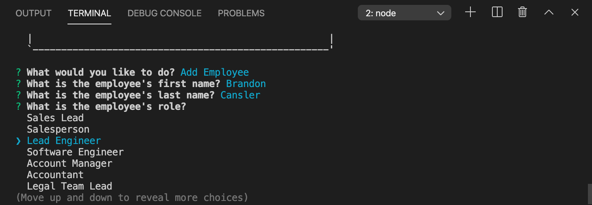
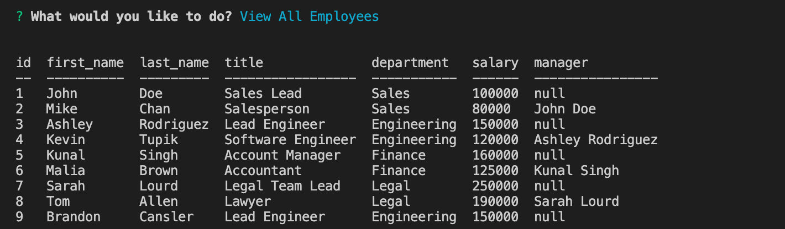

# Employee Manager
A simple application built with node and sql for managing emplyees in a company, viewing them and sorting them by department/role.

## Examples

## How to use it
* run npm install before launching the application
* run both the schema and seed SQL query, the files are located in db/
* launch with "node index" or "npm start" via the command line
* navigate the prompts
* scroll down to "quit" to exit the app

### User Story
* As a business owner
* I want to be able to view and manage the departments, roles, and employees in my company
* So that I can organize and plan my business